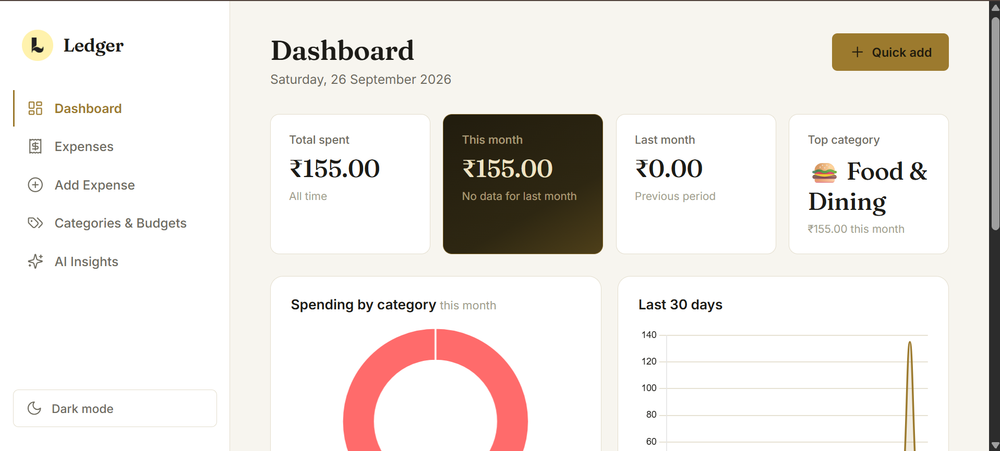
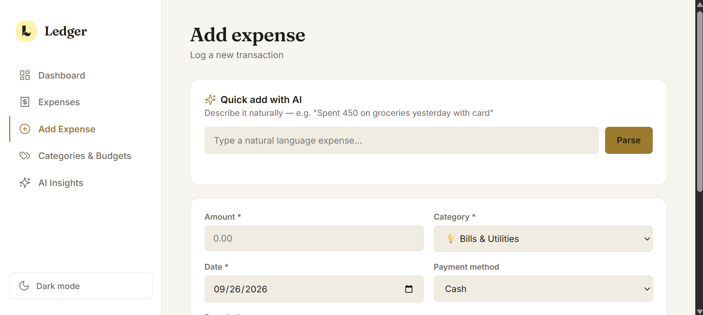
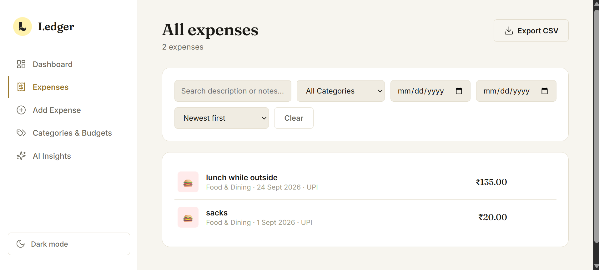
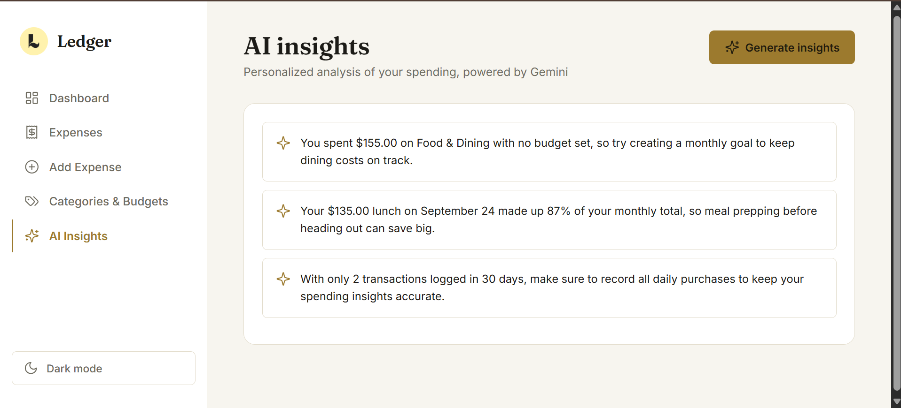

# Expensify

A web-based expense management application built with **Flask, HTML, CSS, JavaScript, and SQLite**, with an AI-powered service integration.

Expensify is designed to help users record, organize, and review their expenses through a simple web interface.

## Screenshots

> Replace the placeholders below with screenshots of the application after adding them to the repository.

### Home / Dashboard

<!-- SCREENSHOT: Add your dashboard screenshot here -->



### Add Expense

<!-- SCREENSHOT: Add your add-expense screenshot here -->



### Expense List

<!-- SCREENSHOT: Add your expense-list screenshot here -->



### AI Assistant

<!-- SCREENSHOT: Add your AI assistant screenshot here -->



## Features

- Add and manage personal expenses
- Organize expenses by category
- View recorded expenses through a web interface
- Expense data stored using SQLite
- Responsive frontend interface
- Flask backend for application logic and API routes
- JavaScript-based frontend interactions
- Gemini/AI service integration
- Custom application logo and favicon

## Tech Stack

### Frontend
- HTML5
- CSS3
- JavaScript

### Backend
- Python
- Flask
- SQLite

### AI
- Google Gemini API

## Project Structure

```text
Expensify/
├── backend/
│   ├── app.py
│   ├── db.py
│   ├── gemini_service.py
│   ├── .env.example
│   ├── .gitignore
│   └── expenses.db
│
├── frontend/
│   ├── index.html
│   ├── style.css
│   ├── script.js
│   ├── logo.png
│   └── favicon.png
│
├── requirements.txt
└── README.md
```

## Installation

### 1. Clone the repository

```bash
git clone <your-repository-url>
cd Expensify
```

### 2. Create a virtual environment

Windows:

```bash
python -m venv .venv
.venv\Scripts\activate
```

macOS/Linux:

```bash
python3 -m venv .venv
source .venv/bin/activate
```

### 3. Install dependencies

```bash
pip install -r requirements.txt
```

## Environment Variables

Create a `.env` file inside the `backend` directory using `.env.example` as a reference.

Example:

```env
GEMINI_API_KEY=your_api_key_here
```

Do not commit your real API key to GitHub.

## Running the Application

From the project root:

```bash
python backend/app.py
```

Then open the local address shown by Flask in your browser.

Typically:

```text
http://127.0.0.1:5000
```

## Database

Expensify uses SQLite for local data storage.

The database file is:

```text
backend/expenses.db
```

For a production deployment, database configuration and secret management should be reviewed before exposing the application publicly.

## AI Integration

The project contains a dedicated AI service:

```text
backend/gemini_service.py
```

This keeps Gemini-related functionality separate from the main Flask application and makes the AI component easier to maintain.

## Configuration

The example environment file is:

```text
backend/.env.example
```

Use it as the template for your local environment variables.

## Future Improvements

Possible improvements include:

- User authentication and account management
- Monthly and yearly expense summaries
- Interactive charts and dashboards
- Export expenses to CSV/PDF
- Budget alerts
- Recurring expenses
- Improved AI-based financial insights
- Cloud database support
- Production deployment configuration
- Automated tests

## Security Notes

- Keep `.env` files out of version control.
- Never publish API keys in source code.
- Use strong secret keys for production deployments.
- Validate and sanitize user input.
- Use HTTPS when deploying the application publicly.

## Author

**Haamidh Mohideen**

Built as a software development project to explore Flask, frontend development, database integration, and AI-powered application features.

## License

Add your preferred license here, such as MIT, if you plan to distribute the project under an open-source license.
